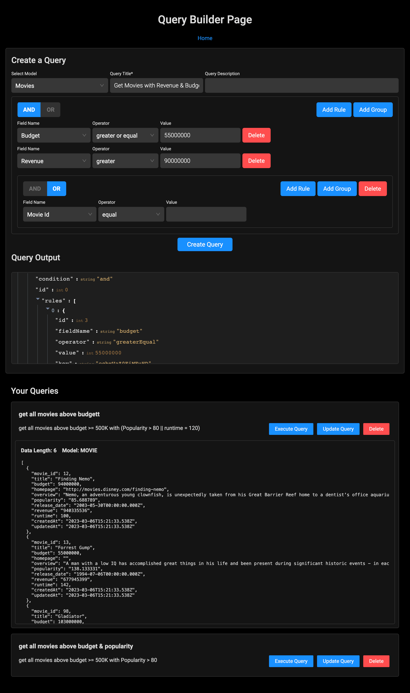

## Screenshot:

## Architecture:

The query builder application is built using a client-server architecture, where the client is built using ReactJS on the frontend and the server is built using Node.js with Express on the backend. The frontend and backend communicate with each other using RESTful API endpoints.

## Design Choices:

#### Frontend Framework: 
ReactJs was chosen for its flexibility, reusability, and performance.
To speed up development and ensure a consistent design, Ant-Desgin inputs were used as a UI library Components, mainly my own CSS is used (flex grid, card container, padding/margin and basic font design)

Backend Framework: The backend of the application is built using Node.js with Express. Express was chosen for its simplicity, flexibility, and scalability.

API Design: 
The RESTful API design was chosen to provide a standardized and scalable way of communicating between the frontend and the backend. Each endpoint is designed to perform a specific action, such as retrieving data or updating data.

Database: 
For this application, I have used a PostgreSQL database to store and retrieve data. PostgreSQL was chosen for this project as a good entry point and have been a good learning Project :)

####Query Building: 
The application allows the user to build custom queries using a simple and intuitive UI. The user can add conditions and clauses to the query as needed, and the application dynamically generates the corresponding with Sequelize/SQL code.

Error Handling: 
The application is designed to handle errors gracefully and provide informative error messages to the user. Error messages are displayed in a user-friendly way and provide information on what went wrong.

## Instructions:

To install and run the query builder application, follow these steps:

Clone the repository to your local machine.
Navigate to the project directory and run "npm install" to install the necessary dependencies.
Start the client by running `npm start` in another terminal window.
Open a web browser and navigate to "http://localhost:3000" to access the application.

## Dependencies:

1. ReactJS: is a popular JavaScript library used for building user interfaces and web applications, known for its efficiency and ability to handle complex UI components.
2. Ant Design is a popular UI library for React applications that provides a wide range of customizable and reusable UI components.
3. Custom CSS - made by me for all the rest
4. Axios: Axios is a popular HTTP client for JavaScript. It is used to make HTTP requests to the back end.
5. Redux + Redux Thunk: Redux and Redux Thunk are commonly used together in JavaScript web applications to manage application state and handle asynchronous actions.
